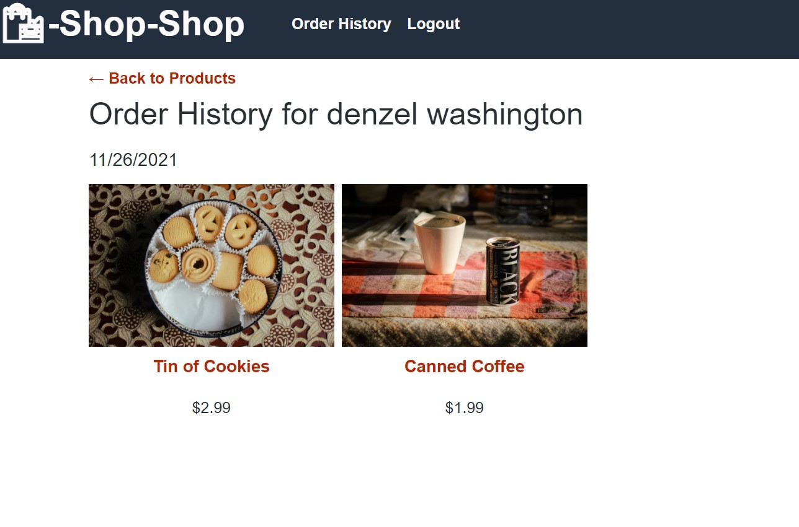

# Shop-Shop

This is an e-commerce shopping site built with MongoDB, Express, React and Node. This application will allow a user to add and remove items from a shopping cart and will run a test checkout using a stripe payment infrastructure.

# Installation

Clone the repository from GitHub and open using Visual Studio Code.

# Usage 

[Deployed Site](https://shannondukes.github.io/Shop-Shop/)

# Credits

Made by Shannon Dukes

[Express](http://expressjs.com/)

[React](https://reactjs.org/)

[MongoDB](https://www.mongodb.com/)

[Mongoose](https://mongoosejs.com/)

[Apollo](https://www.apollographql.com/)

[GraphQL](https://graphql.org/)

[Node.js](https://nodejs.org/en/)

[Jest](https://jestjs.io/)

[Heroku](https://www.heroku.com/home)

[Stripe](https://stripe.com/)

# Questions

[Contact Me](mrs.knit.wit.dukes@gmail.com)

[GitHub](https://github.com/ShannonDukes)